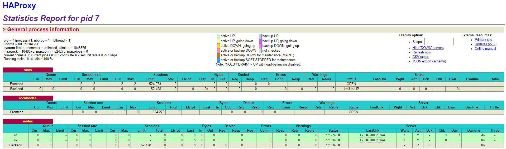
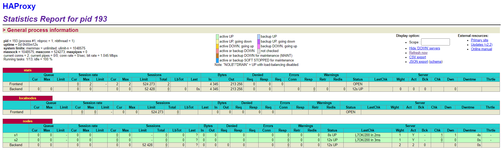
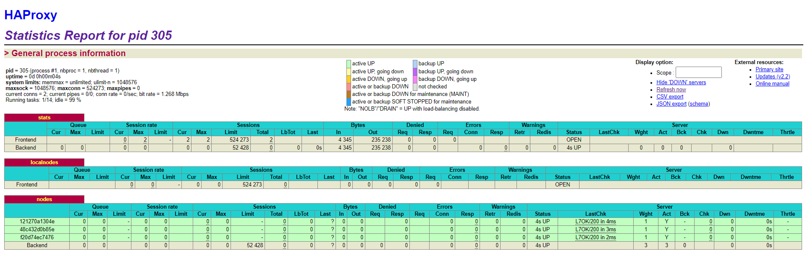
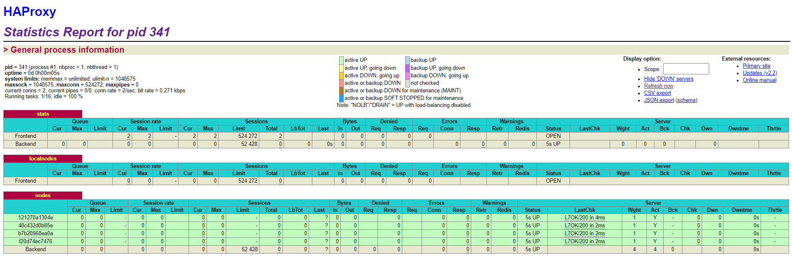
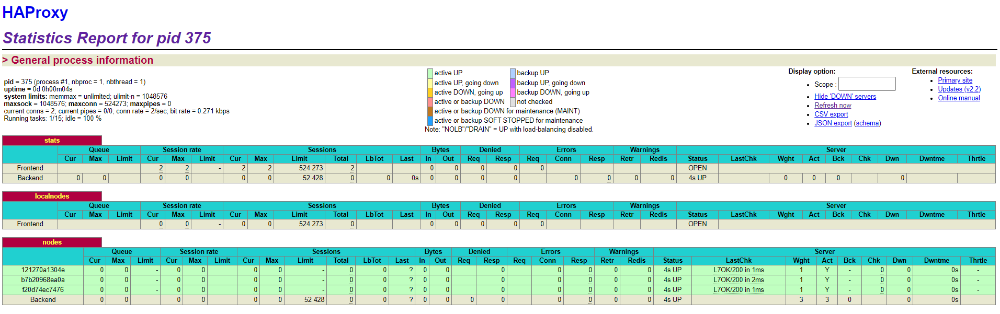

title: Lab 04 - Docker
---
authors : Cuenoud Robin, Dupont Maxime, Mulhauser Florian

## Lab 04 - Docker


#### Pedagogical objectives

* Build your own Docker images

* Become familiar with lightweight process supervision for Docker

* Understand core concepts for dynamic scaling of an application in production

* Put into practice decentralized management of web server instances

### Introduction


### Table of content

0. [Identify issues and install the tools](#task-0)
1. [Add a process supervisor to run several processes](#task-1)
2. [Add a tool to manage membership in the web server cluster](#task-2)
3. [React to membership changes](#task-3)
4. [Use a template engine to easily generate configuration files](#task-4)
5. [Generate a new load balancer configuration when membership changes](#task-5)
6. [Make the load balancer automatically reload the new configuration](#task-6)


### <a name="task-0"></a>Task 0: Identify issues and install the tools

1. <a name="M1"></a>**[M1]** Do you think we can use the current
   solution for a production environment? What are the main problems
   when deploying it in a production environment?
   
    > Our current solution is not suitable for real a production environnement: 
   >
   > We have seen, with the lab wih Galaxus and black friday, that the request on the servers are absolutely not constant. Sometime there are huge increase in connection and we need more servers to handle this load. But it is in some rare occasions, so if we build our servers for our maximum demand, most of the year they will be useless. It is very inefficient and could be very cost expensive for nothing.
   >
   > Thus, we need a flexible solution for our production environnement that can scale ans add server when in need and then scale down when the time allows it.
   >
   > But our current solution gives us a constant number of 2 servers at any time, which is not efficient and don't allow us to create new server when there are a lot of incomming request

2. <a name="M2"></a>**[M2]** Describe what you need to do to add new
   `webapp` container to the infrastructure. Give the exact steps of
   what you have to do without modifiying the way the things are
   done. Hint: You probably have to modify some configuration and
   script files in a Docker image.
   
> To add a new `webapp` container to the infrastructure, we need to create a new environnement variable (WEBAPP_3 and give its name and IP) for it in the `.env` file:
   >
   > We follow the same notation as for the 2 previous webapps
   >
   > ```
   > ...
   > WEBAPP_1_NAME=s1
   > WEBAPP_2_NAME=s2
   > WEBAPP_3_NAME=s3
   > 
   > WEBAPP_1_IP=192.168.42.11
   > WEBAPP_2_IP=192.168.42.22
   > WEBAPP_3_IP=192.168.42.33
   > ...
   > ```
   >
   >  Then we go to the **docker compose file** (`docker-compose.yml`) and we add some lines to configure the `webapp3` (like for webapp 1 and 2)
   >
   > ```
   > webapp3:
   >        container_name: ${WEBAPP_3_NAME}
   >        build:
   >          context: ./webapp
   >          dockerfile: Dockerfile
   >        networks:
   >          heig:
   >            ipv4_address: ${WEBAPP_3_IP}
   >        ports:
   >          - "4002:3000"
   >        environment:
   >             - TAG=${WEBAPP_3_NAME}
   >             - SERVER_IP=${WEBAPP_3_IP}
   > ```
   >
   > In the same file, we also modify the `haproxy` to add this new environnement variable (so we add the last line here):
   >
   > ```
   > haproxy:
   >        container_name: ha
   >        build:
   >          context: ./ha
   >          dockerfile: Dockerfile
   >        ports:
   >          - 80:80
   >          - 1936:1936
   >          - 9999:9999
   >        expose:
   >          - 80
   >          - 1936
   >          - 9999
   >        networks:
   >          heig:
   >            ipv4_address: ${HA_PROXY_IP}
   >        environment:
   >             - WEBAPP_1_IP=${WEBAPP_1_IP}
   >             - WEBAPP_2_IP=${WEBAPP_2_IP}
   >             - WEBAPP_3_IP=${WEBAPP_3_IP}
   > ```
   >
   >  And then we modify the configuration file of haproxy `haproxy.cfg` to add the new environnement variable of the new server (in the `backend nodes` part):
   >
   > ```
   > [...]
   > # Define the list of nodes to be in the balancing mechanism
   > # http://cbonte.github.io/haproxy-dconv/2.2/configuration.html#4-server
   > server s1 ${WEBAPP_1_IP}:3000 check
   > server s2 ${WEBAPP_2_IP}:3000 check
   > server s3 ${WEBAPP_3_IP}:3000 check
   > ```
   >
   > 

3. <a name="M3"></a>**[M3]** Based on your previous answers, you have
   detected some issues in the current solution. Now propose a better
   approach at a high level.
   
    > In the current solution, it takes some work to add a new server, we have to modify small things in         several configuration files. If we do it "by hand", like this, we won't be very reactive and it will take     some time to scale up when the server are on a high demand period. We need to dynamically add/remove web     servers.
   >
   > So a better high level approach would be to create some scripts to automaticlly create a new webapp server container, and update automaticaly the environnement variable and config files of the docker compose and haproxy. If we have a script (or a service) that can do the steps above we can just monitor the demand on the server and execute it automatcaly when the demand is starting to be too high (threshold), thus it will immediatly create a new webapp when needed.

4. <a name="M4"></a>**[M4]** You probably noticed that the list of web
    application nodes is hardcoded in the load balancer
    configuration. How can we manage the web app nodes in a more dynamic
    fashion?
    
 > To be more dynamic, we can think of an application , like a proxy, that will scan the webapps containers to see if one is added or remove one. Then it will tell the load balancer that some changes   occurs to make him update his haproxy configuration dynamically and restart to handle the new situation.
 >
 > Another way of doing it would be to make the webapp container introduce themself to the loadbalancer when created, and when they leave they notify him to. This way he can update dynamicaly. It can be easier to implement but if the webapp crash, maybe the loadbalancer won't notice and won't be notified.

5. <a name="M5"></a>**[M5]**
    Do you think our current solution is able to run additional
   management processes beside the main web server /load balancer
   process in a container? If no, what is missing / required to reach
   the goal? If yes, how to proceed to run for example a log
   forwarding process? 
   
> Unfortunatly the answer is no, our current solution is not able to run an additionnal management process. This is due to our Docker policy that state that one container is a process, thus only one process (our webapp) can be running within our container
>
> To be able to fix it and reach the goal, we need to add a **process supervisor** to the container. This thing will run like a "main" in our container and will handle the multiples process here (haproxy, webapp, monitoring agent, etc).

6. <a name="M6"></a>**[M6]**
   What happens if we add more web server nodes? Do you think it is
   really dynamic? It's far away from being a dynamic
   configuration. Can you propose a solution to solve this?

 > Currently, if we add more web server nodes, nothing happens with them: the haproxy doesn't add it to its configuration file. 
   >
   > The load balancer configuration may be changed dynamically to the existing web server, but it won't be able to update dynamically for an add/remove of a web server.
   >
   > To solve this, we need to do something as discussed in `M3` and `M4` to add/remove the server to the haproxy configuration file dynamically: having a webapp server template and a service/script that change the haproxy container configuration and restart it when an add/remove is detected in the server cluster.


**Deliverables**:

1. Take a screenshot of the stats page of HAProxy at
   <http://192.168.42.42:1936>. You should see your backend nodes.
   
   > 


2. Give the URL of your repository URL in the lab report.

    > https://github.com/MaximeADupont/Teaching-HEIGVD-AIT-2020-Labo-Docker


### <a name="task-1"></a>Task 1: Add a process supervisor to run several processes


1. Take a screenshot of the stats page of HAProxy at
   <http://192.168.42.42:1936>. You should see your backend nodes. It
   should be really similar to the screenshot of the previous task.
   
   > 


2. Describe your difficulties for this task and your understanding of
   what is happening during this task. Explain in your own words why
   are we installing a process supervisor. Do not hesitate to do more
   research and to find more articles on that topic to illustrate the
   problem.
   
   > We didn't get into any big problems in here, some slight confusion because of a wrong copy but other than that everything went smoothly.   
   
   >The process supervisor allows us to run more than 1 process in a docker container. What it (S6) also does is count as a  foreground process, so we can restart the "main process", for example the app here if it crashes, and still have the container running , because it is not the main process of that container.  
   So basically it makes our lives easier by not tying one instance of the webapp and its container together, that way the process supervisor has its container, and it can run multiple processes / restart them if needed, without input need from our part (starting another docker container etc...) .
3

### <a name="task-2"></a>Task 2: Add a tool to manage membership in the web server cluster


**Deliverables**:

1. Provide the docker log output for each of the containers: `ha`,
   `s1` and `s2`. You need to create a folder `logs` in your
   repository to store the files separately from the lab
   report. For each lab task create a folder and name it using the
   task number. No need to create a folder when there are no logs.

   Example:

   ```
   |-- root folder
     |-- logs
       |-- task 1
       |-- task 3
       |-- ...
   ```

2. Give the answer to the question about the existing problem with the
   current solution.
   
  > Our solution is currently a bit too simple:
>
> All nodes have to be registered to the same cluster through the haproxy node. This can causes problem if the haproxy is not running or ready, then some node may not be able to join the cluster. Whereas, with Serf usage we want to be able to join the cluster at any time, through multiple machines, not just one haproxy like here.

3. Give an explanation on how `Serf` is working. Read the official
   website to get more details about the `GOSSIP` protocol used in
   `Serf`. Try to find other solutions that can be used to solve
   similar situations where we need some auto-discovery mechanism.
   
> Wikipedia definition:
>
> *A **gossip protocol** is a procedure or process of computer peer-to-peer communication that is based on the way [epidemics](https://en.wikipedia.org/wiki/Epidemic) spread.[[1\]](https://en.wikipedia.org/wiki/Gossip_protocol#cite_note-1) Some [distributed systems](https://en.wikipedia.org/wiki/Distributed_computing) use peer-to-peer gossip to ensure that data is disseminated to all members of a group. Some ad-hoc networks have no central registry and the only way to spread common data is to rely on each member to pass it along to their neighbours.*
>
> So with Serf, there is a usage of gossip protocol to communicate within the nodes. With the peer-to-peer, all Serf agent exchange with each other to transmit their data like a virus in the cluster.
>
> For this each agent want to join (or create if no existing) the load-balancer. Then if a node arrrive/leave the cluster, with the GOSSIP protocol, the Serf agent will tell all the nodes with thoose 2 messages: Join intent and Leave intent
>
> Other solution for auto-discovery mechanism can be:
>
> (found with https://saipraveenblog.wordpress.com/2014/10/06/service-discovery-in-soamsa/)
>
> * Zookeeper
> * Netflix's Eureka
> * Consul.io
>
> (found with http://jasonwilder.com/blog/2014/02/04/service-discovery-in-the-cloud/)
>
> * Doozer
> * Etcd


### <a name="task-3"></a>Task 3: React to membership changes


**Deliverables**:

1. Provide the docker log output for each of the containers:  `ha`, `s1` and `s2`.
   Put your logs in the `logs` directory you created in the previous task.

3. Provide the logs from the `ha` container gathered directly from the `/var/log/serf.log`
   file present in the container. Put the logs in the `logs` directory in your repo.
   
   > All the logs from this task are in the corresponding folder.  
    I just want to add a small note about the fact that my log file for ha has weird lines about s1 and s2 not being reachable, I have no idea where this comes from.


### <a name="task-4"></a>Task 4: Use a template engine to easily generate configuration files


**Deliverables**:

1. You probably noticed when we added `xz-utils`, we have to rebuild
   the whole image which took some time. What can we do to mitigate
   that? Take a look at the Docker documentation on
   [image layers](https://docs.docker.com/engine/userguide/storagedriver/imagesandcontainers/#images-and-layers).
   Tell us about the pros and cons to merge as much as possible of the
   command. In other words, compare:

  ```
  RUN command 1
  RUN command 2
  RUN command 3
  ```

  vs.

  ```
  RUN command 1 && command 2 && command 3
  ```

  There are also some articles about techniques to reduce the image
  size. Try to find them. They are talking about `squashing` or
  `flattening` images.
  
  > TODO

2. Propose a different approach to architecture our images to be able
   to reuse as much as possible what we have done. Your proposition
   should also try to avoid as much as possible repetitions between
   your images.
   
   > TODO

3. Provide the `/tmp/haproxy.cfg` file generated in the `ha` container
   after each step.  Place the output into the `logs` folder like you
   already did for the Docker logs in the previous tasks. Three files
   are expected.
   
   In addition, provide a log file containing the output of the 
   `docker ps` console and another file (per container) with
   `docker inspect <container>`. Four files are expected.
   
4. Based on the three output files you have collected, what can you
   say about the way we generate it? What is the problem if any?
   
   > TODO


### <a name="task-5"></a>Task 5: Generate a new load balancer configuration when membership changes


**Deliverables**:

1. Provide the file `/usr/local/etc/haproxy/haproxy.cfg` generated in
   the `ha` container after each step. Three files are expected.
   
   In addition, provide a log file containing the output of the 
   `docker ps` console and another file (per container) with
   `docker inspect <container>`. Four files are expected.

2. Provide the list of files from the `/nodes` folder inside the `ha` container.
   One file expected with the command output.

3. Provide the configuration file after you stopped one container and
   the list of nodes present in the `/nodes` folder. One file expected
   with the command output. Two files are expected.
   
    In addition, provide a log file containing the output of the 
   `docker ps` console. One file expected.
   
   > All of the above files are there are requested, there might be some differences between the logs of part 1 and part 3 because we forgot to modify the member-leave script and only noticed it after we saved all the logs from part 1, (we restarted everything the same tho).  
   Because of this we split the logs in a separate folder `part3` added the file `ha_with_fix` just so you can see the different server names from the config file before we remove one (it doesn't change anything, it's only the names that are different, but we felt like it was necessary and it was better than redoing the entire process of step 1, because 1 < 4).

4. As you can see we handed our assignment in late, so we didn't get to it.

### <a name="task-6"></a>Task 6: Make the load balancer automatically reload the new configuration


**Deliverables**:

1. Take a screenshots of the HAProxy stat page showing more than 2 web
   applications running. Additional screenshots are welcome to see a
   sequence of experimentations like shutting down a node and starting
   more nodes.
   
   Also provide the output of `docker ps` in a log file. At least 
   one file is expected. You can provide one output per step of your
   experimentation according to your screenshots.
   
   


Here we can see that we have 3 nodes running, the `docker ps` output for this one and the next ones will be labeled `docker_ps_X.txt` where X is the order in regards to this quick demonstration. 




Now we added one node, and finally we'll remove one (not the same as the last one, lets say the one I named s2).




And here we can see that the node we removed is gone from the list, our setup is complete :D
   
2. Give your own feelings about the final solution. Propose
   improvements or ways to do the things differently. If any, provide
   references to your readings for the improvements.

> TODO

### Difficulty

### Conlusion


